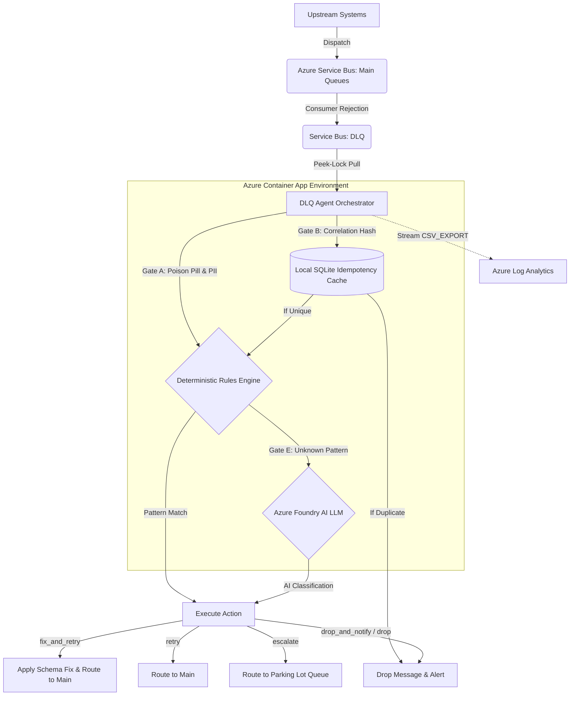

# Autonomous DLQ Triage Pipeline

This repository provisions and operates a hybrid deterministic and AI-augmented error resolution engine for Azure Service Bus Dead Letter Queues (DLQ).

## Scope

- Implements a 'Process Patterns, Not Messages' principle to handle message failures at scale.
- Natively supports Queue DLQs via dynamic configuration mapping and discovery.
- Utilises deterministic heuristics for known business faults to minimise compute latency and token consumption.
- Employs a strictly governed LLM fallback solely for the discovery, classification, and clustering of unknown anomalies.
- Utilises Azure AI Foundry OpenAI Service via user-assigned managed identities for the production state, with fallback support for local LLM providers during offline development.
- Designed for highly sensitive message payloads (e.g., financial transactions) where fully agentic message modification and routing are deemed too unpredictable and risky.

## Delivery Principles

- Code-only provisioning from an empty Azure tenant assumption.
- UK English documentation and naming conventions where platform APIs allow.
- Managed identities and least-privilege access by default.
- Private networking first, with public network access disabled on supported data plane services.
- AI is restricted to read-only analysis; it cannot autonomously modify message payloads without predefined structural heuristic maps.
- Deterministic processing is prioritised to efficiently handle the vast majority of predictable, repeating errors.

## Core Architectural Decisions

### 1. User-Assigned vs. System-Assigned Managed Identity
System-Assigned identities are tightly coupled to the lifecycle of the compute resource. Relying on them creates a severe race condition within Infrastructure as Code (IaC) pipelines: Terraform cannot assign granular Role-Based Access Control (RBAC) permissions (such as Azure Service Bus Data Owner or AcrPull) until *after* the container is provisioned. Consequently, the container initiates, attempts to pull its image or authenticate with the Service Bus, and immediately fails due to missing privileges, resulting in a crash-loop. 

To resolve this, the architecture utilises a **User-Assigned Managed Identity**. This decouples the identity from the compute resource, allowing Terraform to provision the identity, apply all required RBAC assignments strictly across the Virtual Network, and *subsequently* boot the Container App with pre-authorised, Zero Trust access.

### 2. Telemetry Extraction via Log Analytics
Azure Container Apps utilise ephemeral storage. Extracting a physical CSV file (e.g., `reports/telemetry_dashboard.csv`) via the Azure CLI requires elevated container execution privileges (`Microsoft.App/containerApps/getAuthToken/action`). Granting these privileges to standard operational identities violates least-privilege principles.

The chosen solution enforces a **Report-to-Log pattern**. The orchestrator (`src/run_agent.py`) intercepts the generation of CSV rows and prints them to standard output with a strict `CSV_EXPORT|` prefix. This data is ingested securely by the integrated Azure Log Analytics workspace, where it can be natively queried and exported without requiring direct container interaction.

### 3. AMQP Connection Multiplexing & Thread Safety
The Azure Python SDK for Service Bus can experience severe socket exhaustion and `amqp:connection:forced` crashes if multiple threads attempt to instantiate separate underlying AMQP 1.0 connections simultaneously. 

To solve this, the architecture employs a Thread-Safe Singleton pattern (`ServiceBusClientFactory`). The orchestrator establishes a single, resilient TCP connection to the Azure Service Bus and uses strict `threading.Lock()` controls to safely multiplex concurrent DLQ receivers and senders across the thread pool. This drastically reduces the network footprint and prevents SNAT port exhaustion on the container.

### 4. Autonomous Cache Maintenance
The pipeline's Idempotency Store (Gate B) relies on a local database to track UUIDs and block duplicate processing. Over time, in a high-throughput environment, this storage would natively expand until it caused an Out-Of-Memory (OOM) or Disk Full crash on the ephemeral container instance.

To guarantee zero-touch, long-term stability, the orchestrator spawns a decoupled `disk_cleanup_daemon` on a background thread. This daemon wakes hourly to sweep the local cache, safely purging expired DBM keys and ensuring the container's memory footprint remains permanently bounded.

## The 5-Gate Triage Architecture

To ensure strict payload security and deterministic routing, every Dead Letter message passes through an evaluation pipeline before any action is taken:

1. **Gate A: PII Scrubber & Poison Pill Quarantine** - Masks sensitive data (e.g., Luhn validation for credit cards) and immediately quarantines messages exceeding the maximum delivery count (`poison_pill_threshold_exceeded`).
2. **Gate B: Idempotency Store** - Prevents infinite processing loops by hashing message correlation IDs and dropping exact duplicates via a local SQLite cache.
3. **Gate C: Classification Cache** - Bypasses AI and heuristic engines for identical error shapes processed within the Time-To-Live (TTL) window, ensuring rapid processing of identical system outages.
4. **Gate D: Heuristics Engine** - Evaluates messages against deterministic JSON rules mapping specific patterns to safe resolution actions.
5. **Gate E: AI Fallback** - Unknown anomalies are routed securely via Private Endpoints to the Azure AI Foundry model (`gpt-4o-mini`) for rule suggestion, followed by quarantine in a human-review Parking Lot queue.

## Classification Patterns and Actions

The agent dynamically maps incoming anomalies to specific categories. Based on execution telemetry, the pipeline successfully identifies the following failure patterns:

*   **exact_correlation_match_in_cache:** Caught by the Idempotency Gate (`Duplicate_Transaction`).
*   **poison_pill_threshold_exceeded:** Caught by Gate A when max delivery counts are breached (`Resubmit_Limit_Exhausted`).
*   **missing_field_transaction_amount** / **missing_field_customer_id:** Structural payload failures (`Schema_Validation_Failed`).
*   **consumer_crashed_repeatedly:** Downstream application failure (`Delivery_Limit_Exceeded`).
*   **json_syntax_broken:** Malformed incoming payloads (`Payload_Malformed`).
*   **payload_exceeds_broker_limits:** Size limit breaches (`Capacity_Limit_Exceeded`).
*   **unexpected_null_pointer:** Unknown faults intercepted and classified by AI Foundry (`Business_Logic_Violation`).
*   **custom_client_rejection** / **upstream_refused_traffic:** Application-level circuit breakers (`Circuit_Breaker_Open` / `Business_Logic_Violation`).

### Supported Execution Actions

Once categorised, the agent issues a command pattern mapped to one of five deterministic actions:

*   `drop`: Deletes the message silently (utilised for exact correlation matches).
*   `drop_and_notify`: Deletes the message and alerts the upstream client (utilised for payload capacity breaches or severe business violations).
*   `retry`: Re-enqueues the message directly to the main queue (utilised for transient outages like consumer crashes).
*   `fix_and_retry`: Auto-heals structural payload issues via mapped safe defaults (e.g., injecting '0.0' for missing floats) and re-enqueues.
*   `escalate`: Routes the payload to the parking-lot-queue for human review (utilised for malformed JSON or AI-suggested rules requiring approval).

## System Pipeline Flow


## Multi-Queue Configuration and Scalability

This application is scoped to run within a **single Azure tenant**. If processing requires isolation across multiple separate ASB namespaces (e.g., separating Premium tier traffic from Standard tier noisy neighbours), operational teams should deploy a separate container instance per namespace. 

Within a single namespace, the agent supports dynamic scaling across hundreds of Service Bus entities through the following operational models:

### 1. Static/Fallback Configuration

Configuration is handled via a dedicated JSON file referenced in the `.env` file. This acts as the primary source for small-scale deployments, or as a safety fallback if dynamic discovery is explicitly disabled or hits an RBAC 403 error.

```bash
# .env
ASB_SOURCES_FILE="data/asb_sources.json"
```

```json
// data/asb_sources.json
[
  {"type": "queue", "name": "app-a-queue"},
  {"type": "queue", "name": "app-b-queue"}
]
```

### 2. Large-Scale Deployments

Maintaining a hardcoded JSON array for hundreds of queues is an operational anti-pattern. This architecture addresses scale via:

* **Dynamic Discovery:** Utilises the `ServiceBusAdministrationClient` to programmatically query the namespace on boot, automatically discovering all eligible queues.
* **Exclusion Filters:** Utilises the `EXCLUDED_QUEUES` environment variable to blacklist specific topics or queues from the dynamic discovery process, isolating operational traffic.
* **Bounded Concurrency (Polling):** The agent does not assign a thread to every discovered DLQ simultaneously. Instead, it works through the discovered list using a fixed `ThreadPoolExecutor` up to the `MAX_CONCURRENT_QUEUES` limit. 
* **```CRITICAL PATCH``` - Thread Pool Elevation:** The `ThreadPoolExecutor` is elevated *outside* the infinite polling loop. This prevents aggressive OS thread-churn (creating and destroying threads every 60 seconds). Once the active batch is processed across the persistent worker threads, the main thread yields the CPU via `AGENT_CYCLE_SLEEP_SECONDS` before polling again.

## Repository Layout

```text
VIVA-DLQ-AGENT/
├── data/
│   ├── asb_sources.json                    # Fallback queue definitions
│   └── rules.json                          # Deterministic heuristic definitions
├── docs/
│   ├── DEPLOYMENT_RUNBOOK.md               # Infrastructure IaC deployment guide
│   └── ops_guide.md                        # operations and maintenance 
├── infra/
│   ├── scripts/                            # Bash and PowerShell rollout automation
│   └── terraform/                          
│       └── azure/                          # Azure-specific Terraform root
│           ├── .terraform/                 # Local Terraform provider binaries and cache
│           ├── bootstrap/                  # Remote state Storage Account & Key Vault
│           ├── environments/               # Target state tfvars
│           ├── modules/                    # Isolated IaC definitions
│           │   ├── agent_hosting/          # Azure Container Apps and environment variables
│           │   ├── bastion_jumpbox/        # Secure SSH entry point via Azure Bastion
│           │   ├── data_services/          # Service Bus namespaces and Container Registry
│           │   ├── dns/                    # Private DNS Zones for VNet resolution
│           │   ├── foundation/             # Base Resource Group deployments
│           │   ├── foundry/                # Azure AI Foundry / Cognitive Services accounts
│           │   ├── identity/               # User-Assigned Managed Identities and RBAC mapping
│           │   ├── network/                # Virtual Networks, Subnets, and NSGs
│           │   ├── observability/          # Log Analytics Workspaces integration
│           │   └── private_endpoints/      # VNet peering for secure internal routing
│           ├── platform/
│           ├── main.tf                     # Root orchestrator connecting all modules
│           ├── variables.tf                # Global input variable definitions
│           ├── versions.tf                 # Terraform provider version constraints
│           └── .terraform.lock.hcl
├── reports/
│   └── telemetry_dashboard.csv             # Output generated during local execution
├── simulator/
│   ├── consumer.py                         # Generates downstream rejections
│   └── producer.py                         # Injects synthetic anomalies
├── src/
│   ├── action_executor.py                  # Command pattern implementations
│   ├── ai_client.py                        # Foundry/Ollama LLM factory
│   ├── autonomous_dlq_classifier.py        # Core  5-gate pipeline logic
│   ├── flush_queues.py                     # Administrative ASB sanitisation
│   ├── run_agent.py                        # Orchestrator and thread pool polling
│   └── state_managers.py                   # Caching logic
├── tests/                                  # Pytest suite
├── .env.example
├── docker-compose.yml                      # Local environment orchestration
├── Dockerfile                              # Multi-stage production container
├── pytest.ini                              # Pytest configuration and strict markers
├── README.md
├── requirements-dev.txt                    # CI/CD and linting dependencies
└── requirements.txt                        # Production Python dependencies
```

## Verification of Execution

The agent operates silently in the background, waking on a defined interval to process queued anomalies concurrently across multiple threads. It successfully parses anomalies, executes automated structural fixes, and interfaces with the Azure Foundry Private Endpoint for unknown classifications.

### Agent Container Console Trace
The following execution trace demonstrates the agent healing schema validation failures and executing successful requests to Azure Foundry (`gpt-4o-mini`) via zero-trust managed identities:

```text
2026-06-14 21:37:33,307 - INFO - [ThreadPoolExecutor-0_0] - ManagedIdentityCredential.get_token succeeded
2026-06-14 21:37:33,307 - INFO - [ThreadPoolExecutor-0_0] - DefaultAzureCredential acquired a token from ManagedIdentityCredential
...
2026-06-14 21:37:34,151 - INFO - [ThreadPoolExecutor-0_0] - Structural fix applied: Injected 'transaction_amount' with strongly-typed value '0.0' (float).
2026-06-14 21:37:34,171 - INFO - [ThreadPoolExecutor-0_1] - Structural fix applied: Injected 'transaction_amount' with strongly-typed value '0.0' (float).
2026-06-14 21:37:34,172 - INFO - [ThreadPoolExecutor-0_0] - Successfully auto-healed and resubmitted message 521169e2-746d-415c-8f04-7f202c6820f3.
...
2026-06-14 21:37:34,270 - INFO - [ThreadPoolExecutor-0_1] - Invoking Azure Foundry model: gpt-4o-mini for client: Omega_Corp
2026-06-14 21:37:35,161 - INFO - [ThreadPoolExecutor-0_1] - Response status: 200
```

### Telemetry Dashboard Data
The output captured in Log Analytics demonstrates the full spectrum of the agent's capabilities:

```csv
timestamp,source_queue,client_id,message_type,classification,pattern,status,occurrence_count,suggested_action,confidence_score
2026-06-15T06:26:35.579083,viva-integration-queue,Zeta_Corp,PaymentRequest,Duplicate_Transaction,exact_correlation_match_in_cache,Dropped,2,N/A,N/A
2026-06-15T06:26:32.908666,viva-integration-queue,Zeta_Corp,PaymentRequest,Delivery_Limit_Exceeded,consumer_crashed_repeatedly,Auto_Classified_From_Cache,1,retry,N/A
2026-06-15T06:26:32.659152,viva-integration-queue,Theta_Corp,AccountSync,Schema_Validation_Failed,missing_field_customer_id,Auto_Classified_From_Cache,1,fix_and_retry,N/A
2026-06-15T06:26:32.612080,viva-integration-queue,Omega_Corp,LegacySync,Business_Logic_Violation,unexpected_null_pointer,AI_Suggested_Rule_Pending_Approval,1,drop_and_notify,0.85
2026-06-15T06:26:30.097801,viva-payment-queue,Beta_Corp,PaymentRequest,Resubmit_Limit_Exhausted,poison_pill_threshold_exceeded,Quarantined,1,N/A,N/A
```

## Documentation Index

- Detailed IaC execution and bootstrapping: `docs/DEPLOYMENT_RUNBOOK.md`
- Operations, troubleshooting, and KQL metric extraction: `docs/ops_guide.md`